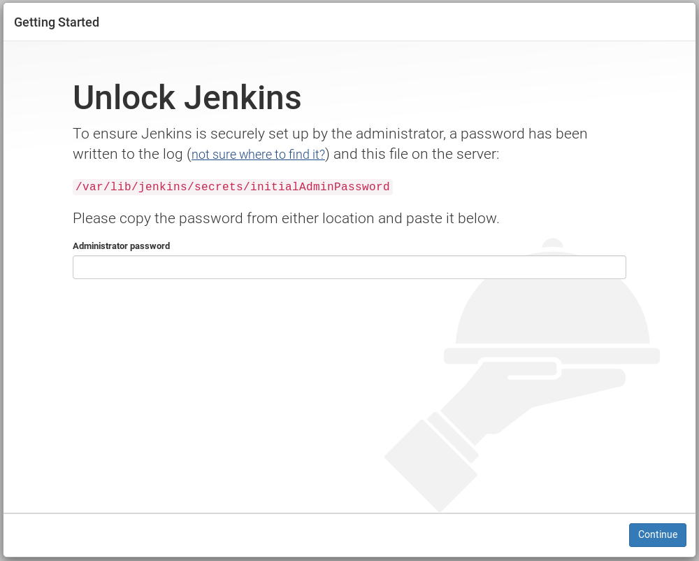
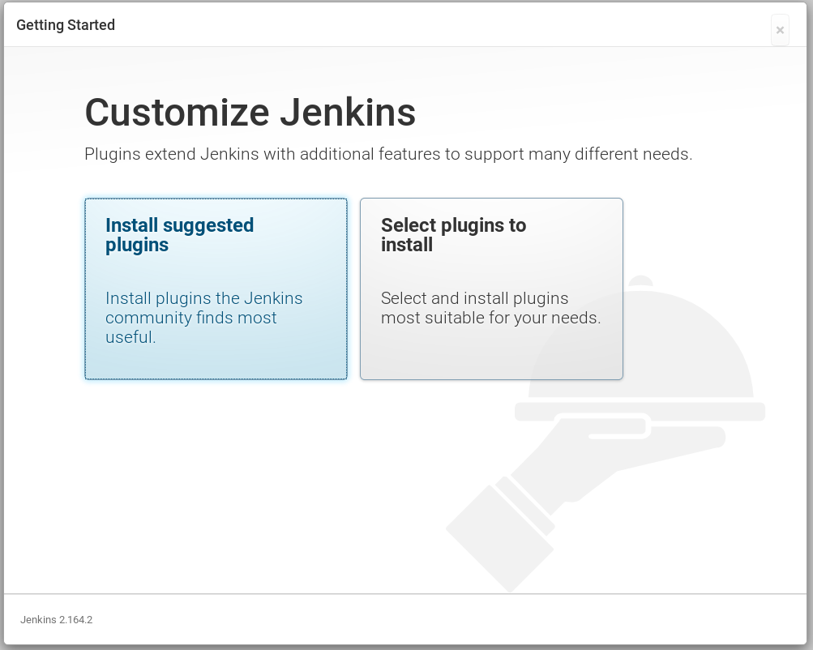
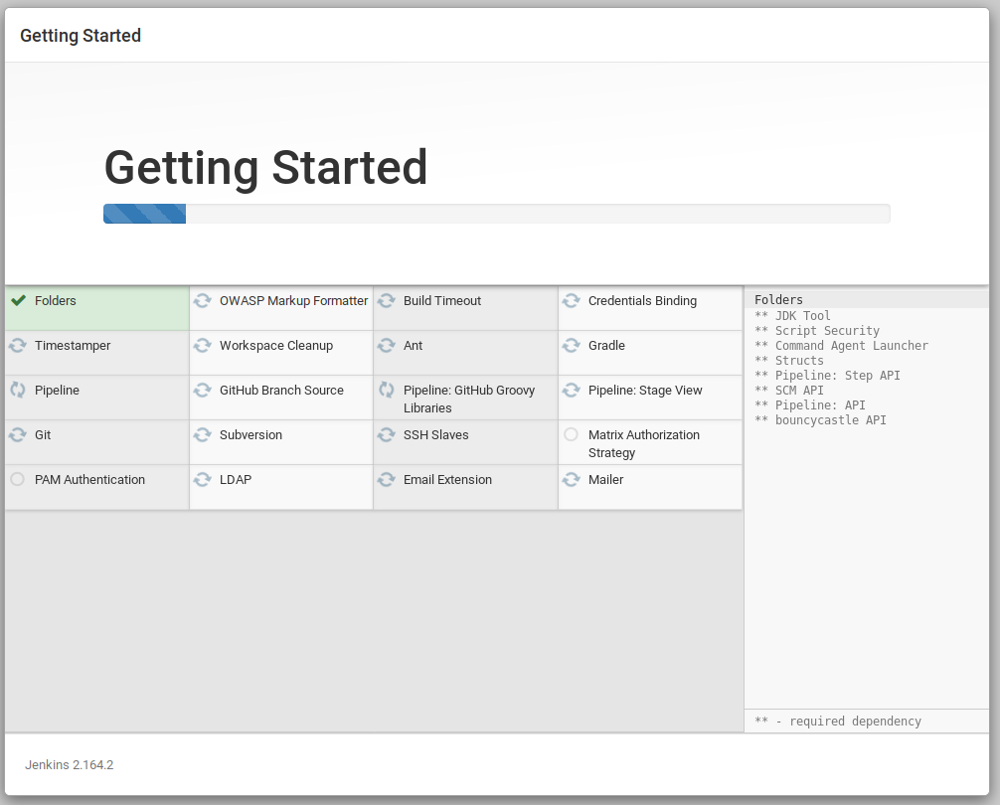
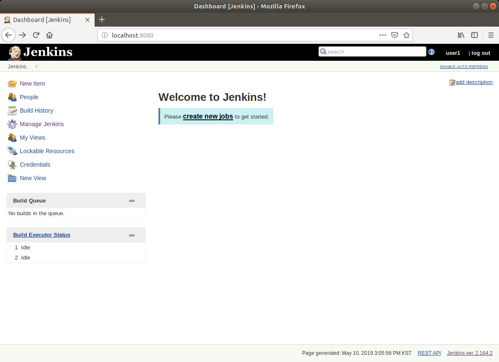
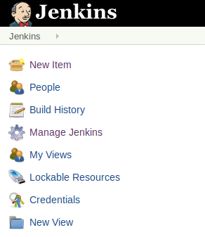
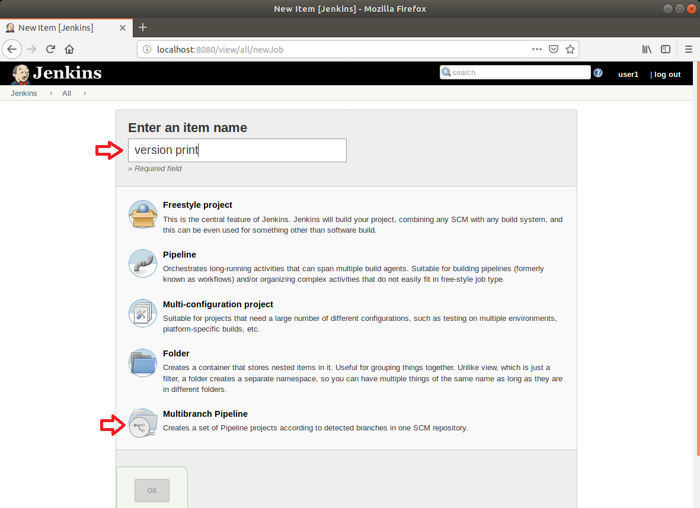
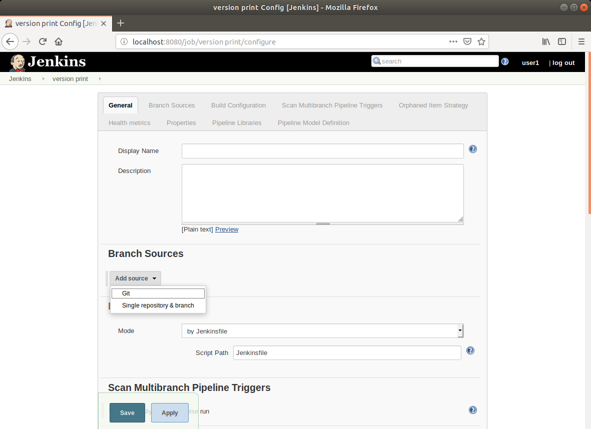
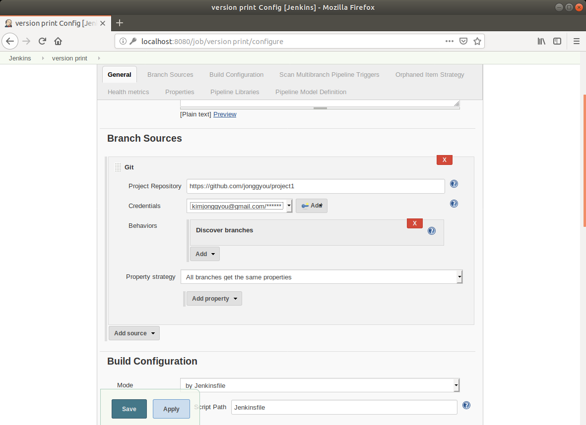

# Jenkins

Jenkins는 CI/CD 툴이며 홈페이지는 https://jenkins.io 이다.

## Jenkins 설치

https://jenkins.io/download 에 접속하면 각 OS 별 jenkins 설치방법에 대한 설명 및 다운로드가 가능하다.
ubuntu/debian의 경우 버젼에 맞는 java 가 필요하다. jenkins는 Java 9 에서는 수행되지 않는다.

- 2.54 (2017-04) and newer: Java 8
- 1.612 (2015-05) and newer: Java 7

해당 버젼에 알맞은 JDK를 설치하도록 한다.
설치가 완료되면 http://localhost:8080 에 접속한다.

>VM에는 jenkins와 OpenJDK Java 8 이 이미 설치되어 있어서 설정하는 화면은 나타나지 않고 초기화면이 나올 것이다.

접속하면 다음과 같은 화면을 볼 수 있다.

표시되어 있는 **/var/lib/jenkins/secrets/initialAdminPassword** 파일에서 패스워드를 복사해서 입력하고 다음을 눌러준다.  
파일을 읽기 위해서는 root 권한으로 읽어야 한다.

~~~
$ sudo cat /var/lib/jenkins/secrets/initialAdminPassword
~~~

다음과 같은 화면이 나오면 **Install suggested plugins**을 눌러준다.

plugin이 설치될 것이다.

설치가 완료되고 username/password/email 등을 넣고 시작하면 다음과 같은 화면이 보일 것이다.

## java 파이프라인 생성

Jenkins Pipeline (또는 단순히 "Pipeline")은 Jenkins에 지속적인 전송 파이프 라인 을 구현하고 통합하는 것을 지원하는 플러그이다.

continuous delivery pipeline은 사용자와 고객에 이르기까지 버전 제어에서 소프트웨어를 가져 오는 프로세스의 자동화 된 표현이다.

Jenkins Pipeline은 복잡한 전달 파이프 라인을 "코드"로 모델링 할 수있는 확장 가능한 도구 세트를 제공한다.

1. Jenkins 메뉴중 **New Item** 을 클릭하여 새로운 job을 만든다.

    

1. 아이템 이름을 넣어주고(예:version print) 하위의 **Multibranch Pipeline**를 선택한다. 이 항목은 git repository가 변경되면 수행하는 것을 의미한다.

    

    OK를 누른다.

1. Branch Sources 항목의 **Add source**를 선택하면 Git 을 선택할 수 있다. 

    

    Git을 선택하면 Git Repository의 주소를 넣는 부분에 기존에 만들었던 git repository의 주소를 넣는다.

    Credentials 에는 git repository에 접근하기 위한 username/password를 넣어준다.

    

    OK를 누르면 다음과 같이 jenkins가 git reposotory를 살펴보는 로그가 나오게 된다.

    

    성공적으로 repository를 체크하고 Jenkinsfile 을 살펴보고 있음을 알 수 있다.

## node.js 파이프라인 생성

1. 아래의 내용으로 project1 디렉토리 내에 Jenkinsfile 이라는 이름으로 저장한다.

    ~~~jenkinsfile
    pipeline {
        agent { docker { image 'node:6.3' } }
        stages {
            stage('build') {
                steps {
                    sh 'npm --version'
                }
            }
        }
    }
    ~~~

    의미는 node:6.3 이라는 이름의 도커 이미지를 바탕으로 npm --version 명령을 실행하는 것이다.

    이제 Jenkinsfile 을 github repository에 push 하도록 한다.
    ~~~
    $ git add .
    $ git commit -m 'add jenkinsfile'
    $ git push
    ~~~
    
    push를 하면 jenkins가 repository가 변한것을 감지하고 jenkinsfile의 내용을 기반으로 작업을 수행한다.

## 멀티플 스텝 수행

## 실행 환경 설정

## 실행 변수 설정

## 배포

---
참고: https://jenkins.io/doc